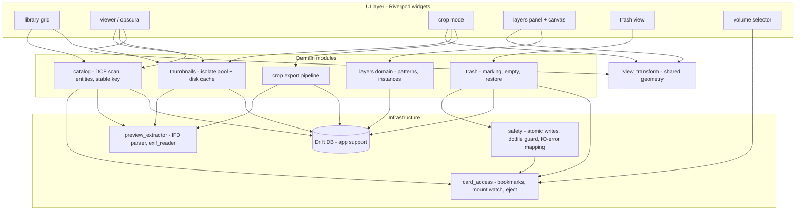
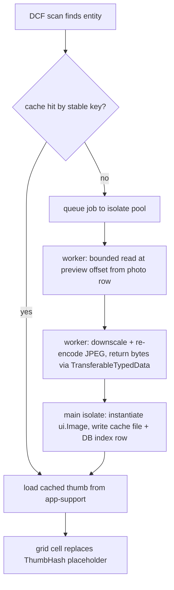
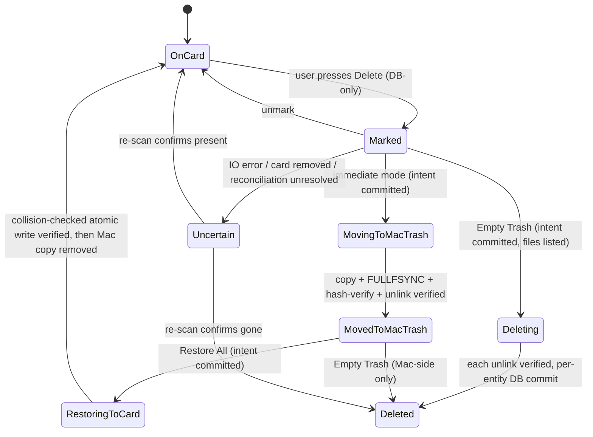

# Obscura Pro — Leica Q3 Culling App - Plan

## Goal Capsule

- **Objective:** Build Obscura Pro, a Flutter macOS desktop app for ultra-fast culling of Leica Q3 photos directly on the SD card — thumbnail grid from embedded JPEG previews, keyboard-driven viewer, safe entity-wide deletion via an off-card trash, obscura mode, non-destructive crop/export to the Mac, and composition-analysis layers from the 30 "Grammaire du cadre" patterns.
- **Authority hierarchy:** `docs/reference/spec-q3-culling.md` (the spec) is authoritative for behavior and constraints. `docs/reference/design-system.md` and `docs/reference/maquettes/` are authoritative for visual style and layout only — maquette elements absent from the spec (Import Photos, Cloud Sync, Favorites, Recents, Compare, search) are out of scope. This plan resolves conflicts; the spec wins over maquettes.
- **Execution profile:** Greenfield repo. Phased delivery A → B → C (see Implementation Units); units within a phase are dependency-ordered. U2 (real-DNG spike) gates the thumbnail pipeline design.
- **Stop conditions:** Stop and surface if (a) the U2 spike shows Q3 DNGs carry no usable embedded full-size preview, (b) security-scoped bookmark access to `/Volumes` proves unworkable under sandbox, or (c) any step would require writing non-DCF files onto the card. Each invalidates a load-bearing decision.
- **Tail ownership:** Implementer owns commits, branch strategy, and PR shape; no PR/landing strategy is imposed by this plan.

---

## Product Contract

### Summary

Plan the full application across the spec's stages 1–3 as one phased greenfield build: Phase A delivers the safe-culling MVP (card access, DCF catalog, thumbnail grid, viewer, obscura, trash, card-safety hardening), Phase B adds crop/export, Phase C adds composition layers. Stage 4 (LibRaw demosaicing) is deferred. Drift is introduced in Phase A so the stable photo key, thumbnail cache, and trash share one schema from the start.

### Problem Frame

A Leica Q3 photographer returning from a session wants to triage, delete, and crop images directly on the SD card, without an import step. Existing tools either import first (slow, duplicates data) or treat the card as a generic disk (risking DCF corruption, parasite files on the non-journaled exFAT volume, and camera index breakage). The card must remain perfectly readable by the Q3 afterward: card integrity dominates every other requirement. Speed comes from a Q3-specific fact — every DNG embeds a full-resolution JPEG preview, so the app never needs to demosaic RAW for display.

### Requirements

Spec IDs (`FONC-*`, `PERF-*`, `CARTE-*`, etc.) are cited from `docs/reference/spec-q3-culling.md` for traceability.

**Card access & session**

- R1. The user selects the mounted card volume via the system open panel; access persists across sessions through a security-scoped bookmark (spec §6.1).
- R2. The app provides clean eject (⌘⏏) that flushes and unmounts, and warns when the card is removed without ejecting (CARTE-4).

**Catalog & grid**

- R3. The app scans `DCIM/###LEICA/` and groups same-radical `DNG`+`JPG` files into one photo entity with a RAW+JPG badge (FONC-GRID-2); orphan DNG-only or JPG-only entities still display with a format badge (spec §9).
- R4. Grid thumbnails come exclusively from embedded JPEG previews (small IFD thumbnail for the grid, full-size preview for the viewer) — never from RAW demosaicing (FONC-GRID-1).
- R5. Decoded thumbnails are cached on the Mac (application-support), keyed by the stable photo key, reused across sessions; nothing is ever cached on the card (FONC-GRID-3).
- R6. All decode work runs in isolates off the UI thread; pending cells show ThumbHash/average-color placeholders (FONC-GRID-4).

**Viewer & navigation**

- R7. Enter/double-click opens the full-size embedded preview; ←/→ navigates with a preload window so next/previous feels instantaneous (FONC-VIEW-1, FONC-VIEW-2, PERF-2).
- R8. An optional EXIF overlay shows focal/crop, shutter, aperture, ISO (FONC-VIEW-3).
- R9. Zoom/pan via trackpad pinch, wheel, double-click 100%/fit toggle, and ⌘+/⌘−/⌘0, built on `InteractiveViewer` (FONC-ZOOM-1).
- R10. Obscura mode (key O) renders the image rotated 180° — rotation, not mirror, no darkening — and composes with layers (FONC-OBS-1, FONC-OBS-2).
- R11. The full keyboard map of spec §5 is implemented with Flutter `Shortcuts`/`Actions`/`Intent` (no plugin).

**Deletion & trash**

- R12. Deleting a photo removes the whole entity — every file sharing the radical — and the confirmation lists the exact files (FONC-DEL-1).
- R13. Default deletion is deferred marking (files stay on card until "Empty Trash"); an immediate-move-to-Mac-trash mode exists; permanent card deletion happens only on explicit "Empty Trash" (FONC-DEL-2). Trash view supports restore, per the trash maquette.
- R14. Deletion never renumbers or renames remaining files or folders (FONC-DEL-3, CARTE-6).

**Crop & export (Phase B)**

- R15. Crop ratios are exactly 3:2, 4:3, 5:4, 1:1, 16:9, 65:24 — each in landscape and portrait (except 1:1), no free ratio (FONC-CROP-1).
- R16. Cropping never touches the DNG; it exports a new JPEG to a configurable Mac folder (default `~/Pictures/Q3Culling/Exports/<date-session>/`), named `<radical>_<ratio>_<index>.jpg`, sourced from the full-size embedded preview, with essential EXIF copied, sRGB (FONC-CROP-2, FONC-CROP-3); each export is recorded for traceability (`crop_export`).

**Composition layers (Phase C)**

- R17. A library of 30 vector patterns from `docs/reference/grammaire-du-cadre.html` renders via `CustomPainter` (FONC-LAY-1).
- R18. Dropping a pattern creates a per-photo instance with normalized position/scale/rotation/opacity/stroke-color, manipulated through corner/center handles with hit-testing, undoable (⌘Z), persisted in the Mac-side database under the stable key (FONC-LAY-2..4).

**Card integrity (cross-cutting, dominant)**

- R19. Strict DCF 2.0 respect: never rename, renumber, or move camera files/folders (CARTE-1).
- R20. Zero parasite files on the card: no `.DS_Store`, `._*`, `.Spotlight-V100`, `.fseventsd`, `.Trashes`, `.TemporaryItems`; Spotlight indexing of the volume disabled; optional user-requested dotfile cleanup before eject (CARTE-2).
- R21. Any card write follows the atomic protocol — temp file → `fsync` → atomic rename → directory `fsync` — and deletion is unitary and verified (CARTE-3, FIAB-1).
- R22. Card disappearance mid-operation is detected; the operation stops, the affected entity is marked "uncertain", and a re-scan is offered on remount; Mac-side data is never lost (CARTE-5). Read-only cards disable destructive actions gracefully (spec §9).
- R23. Stable photo key = hash of DCF radical + EXIF `DateTimeOriginal` + body serial (+ size/mtime fallback), robust to remount-point changes and camera numbering resets (spec §7).

**Performance targets** (validated by profiling in release mode, not debug)

- R24. First row of thumbnails < 500 ms after scan; grid of hundreds of DNGs scrolls at 60 fps (PERF-1); next/previous < 100 ms perceived (PERF-2); zoom/pan ≥ 60 fps (PERF-3); bounded number of full-size previews in RAM (MEM-1).

### Scope Boundaries

- **Deferred to Follow-Up Work:** Stage 4 "pro quality" — LibRaw FFI demosaicing for max-quality exports, color profiles, batch export (spec deems `flutter_libraw` too immature today); App Store distribution (plan targets Developer ID + notarization posture only as build configuration, not a release pipeline); localization (UI ships in French per maquettes).
- **Outside this product's identity:** photo import/copy workflows, cloud sync, favorites/ratings, recents, compare mode, search, any RAW editing — the maquettes show some of these as chrome, but the spec's identity is "work directly on the card, no import"; they are not planned. (session-settled: user-directed — chosen over including maquette extras: spec is authoritative, maquettes are visual reference only.)
- **Outside scope:** writing anything to the card other than entity deletion; modifying or re-encoding DNGs.

### Acceptance Examples

- AE1. **Cull a session.** Given a mounted Q3 card with 300 DNG+JPG pairs, when the user opens the app, picks the volume, arrows through the grid, marks 40 photos with ⌫, empties the trash, and ejects with ⌘⏏ — then the 40 entities' files (both DNG and JPG each) are gone, the other 260 are untouched byte-for-byte, `ls -la@` on the volume shows zero parasite files, and the card boots in the Q3 with numbering intact.
- AE2. **Card yanked mid-delete.** Given an "Empty Trash" in progress, when the volume disappears, then the operation halts, affected entities are flagged "uncertain", the app offers re-scan on remount, and the Mac-side trash/cache is intact.
- AE3. **Layers survive remount.** Given a photo with a golden-spiral layer placed and saved, when the card is ejected and remounted at a different mount point (or the camera later reuses `L1000001` after a numbering reset with a different capture date), then the layer reappears on the correct photo only.
- AE4. **Crop export.** Given a photo open in crop mode, when the user picks 3:2 portrait and hits ⌘E, then `L1000123_3x2_01.jpg` appears under the export folder at full-preview-derived resolution with EXIF date/model/focal copied, and the DNG on card is bit-identical; the 1:1 ratio offers no portrait toggle, every other ratio offers both orientations, and no free ratio is reachable anywhere in the UI.

### Sources & Research

- `docs/reference/spec-q3-culling.md` — authoritative technical spec (embeds its own external research with citations: Leica datasheet May 2023, DCF/CIPA DC-009, Apple sandbox docs, 2026 Flutter DB landscape).
- `docs/reference/design-system.md` — "L-System" design tokens (colors, Inter typography, spacing, component specs).
- `docs/reference/maquettes/*.png` — 8 Stitch screens (layout/style reference).
- `docs/reference/grammaire-du-cadre.html` — the 30 composition patterns with inline SVGs (source of truth for Phase C pattern geometry).
- Package verification (2026-08-11): [crop_your_image](https://pub.dev/packages/crop_your_image) active, `CropController` supports fixed `aspectRatio`; [exif_reader](https://pub.dev/packages/exif_reader) decodes DNG EXIF but does not document embedded-preview byte extraction — hence the U2 spike and the KTD-5 fallback parser.

---

## Planning Contract

### Key Technical Decisions

- KTD-1. **Previews only, never demosaic (display and V1 export).** Grid uses the small embedded thumbnail; viewer and export use the full-size embedded JPEG preview. Rationale: Q3 DNGs embed a full-resolution preview; decoding JPEG is orders of magnitude cheaper than RAW demosaicing and matches the camera's own rendering (see origin: spec §3.1, Key Finding 1).
- KTD-2. **Riverpod for state, isolate pool for decode, Drift (SQLite) for persistence.** Fixed up front per the spec's "decisions to freeze" (see origin: spec Recommendations). Drift DB lives in `~/Library/Application Support/`, never on the card.
- KTD-3. **Drift schema lands in Phase A, not Phase C.** The stable key, thumbnail cache index, and trash state need durable storage from the MVP; adding the DB later would force a mid-project migration. Spec's schema (pattern, photo, layer_instance, crop_export) is extended with a `trash_item` table and a thumbnail-cache index table.
- KTD-4. **Stable photo key** = SHA-256 over DCF radical + EXIF `DateTimeOriginal` + body serial, with size+mtime fallback when EXIF is unreadable (see origin: spec §7). All Mac-side state (layers, cache, trash, exports) keys off it, never off absolute paths.
- KTD-5. **Preview extraction: `exif_reader` for tags; own minimal TIFF/IFD offset reader for preview bytes if needed.** `exif_reader` confirms DNG tag decoding but embedded-preview byte extraction is undocumented; reading `JPEGInterchangeFormat`/`JPEGInterchangeFormatLength` (and SubIFD `StripOffsets`) from the IFD chain is a small, well-specified parser. U2 settles which path is needed before U6 hardens the pipeline.
- KTD-6. **Normalized coordinates (0..1) everywhere** for layer transforms and crop rects, so state is display-resolution-independent (see origin: spec §6.3, §7).
- KTD-7. **Off-card trash with deferred marking as default.** Marking keeps files on card until explicit "Empty Trash"; immediate mode moves files to a Mac-side trash folder. Minimizes exFAT writes and preserves recoverability (see origin: spec §3.3, CARTE-7).
- KTD-8. **Composition patterns bundled as a generated Dart asset, seeded into Drift on first run.** A build-time script parses the 30 SVGs out of `docs/reference/grammaire-du-cadre.html` into typed vector primitives (lines, arcs, paths in normalized space) checked into `lib/features/layers/patterns/`. Rationale: runtime HTML parsing is fragile and the source file is static; a generated artifact is reviewable and testable. Chosen over a full SVG-rendering dependency: patterns are simple strokes, `CustomPainter` primitives suffice.
- KTD-9. **`crop_your_image` for the crop UI** with `CropController`-enforced ratios; export encode via `image`/`dart:ui` from the full-size preview (see origin: spec §3.4; verified current 2026-08).
- KTD-10. **Sandbox + entitlements from day one**, edited directly in both `Runner-Release.entitlements` and `Runner-DebugProfile.entitlements` (app-sandbox, user-selected read-write, app-scope bookmarks), Hardened Runtime enabled for future notarization (see origin: spec §6.1).
- KTD-11. **Project: greenfield `obscura_pro` repo.** (session-settled: user-approved — chosen over q3_culling naming: maquette brand name retained.)
- KTD-12. **One authoritative `ViewTransform` abstraction for the whole coordinate stack.** A single value/service — inputs: image pixel size, fitted display rect, viewer transformation matrix, obscura flag — exposes `screenToNormalized`/`normalizedToScreen`. Delivered in U8, consumed by crop (U11) and layers (U13). Crop rects and layer transforms are stored in un-rotated image-normalized space; obscura is a presentation-time flip `(x,y)→(1−x,1−y)` inside the transform chain, never a mutation of stored coordinates. Rationale: four consumers share the screen↔image mapping (zoom/pan matrix, obscura rotation, handle hit-testing, crop rects); three independent implementations would diverge exactly where bugs are hardest to see (pointer events under rotation, zoom-to-cursor).
- KTD-13. **Isolate boundary carries encoded bytes, never bitmaps; the main isolate owns all DB and cache writes.** Worker input = file path + preview offset/length + target size; worker does a bounded read, downscale, and re-encode to JPEG bytes returned via `TransferableTypedData`; the main isolate instantiates `ui.Image` (engine codec, already off-thread) and performs cache-file and Drift writes. Rationale: `dart:ui` images cannot cross isolates, a decoded 60 Mpx preview is ~240 MB raw (copying it would destroy PERF-1/3), and pool workers writing Drift would fight the single connection. Full-size viewer decode uses the engine codec from extracted bytes, not the pure-Dart `image` decoder.
- KTD-14. **Destructive card operations follow intent-commit ordering: DB-intent first, verified card op, DB-commit last.** Every card mutation is preceded by a durable per-file intent row and followed by an on-disk verification before the outcome state is recorded; a startup reconciliation pass resolves interrupted operations by intent + observation. Invariant: at every instant, at least one verified complete copy of every non-Deleted entity exists (card or Mac trash), and the DB never records a destructive outcome that was not verified on disk. Honest durability claim: per-operation durability on exFAT through a USB reader is unattainable (`F_FULLFSYNC` is commonly ignored by card readers; exFAT has no journal); the app's real guarantees are app-crash consistency via intent rows + reconciliation, with clean eject as the durability barrier.

### High-Level Technical Design

**Module architecture** (feature-first; arrows = allowed dependencies):



**Thumbnail data flow** (grid fill path, PERF-1):



**Riverpod reactive spine** (each provider has one owning unit; U7–U9 consume, never redefine):

| Provider | Owns | Landed in |
|---|---|---|
| volume session | selected volume, bookmark handle, mount state | U3 |
| entity list | ordered photo entities + badges (reactive over Drift) | U5 |
| selection set | grid multi-selection + anchor for keyboard nav | U7 |
| current photo | viewer index into entity list | U8 |
| preload window | derived from current photo ±N; consumed by the thumbnail pipeline for prefetch and LRU eviction | U8 (derived), U6 (consumed) |
| viewer prefs | obscura, EXIF overlay, zoom state | U8 |
| trash state | marked/moved counts, pending bytes (reactive over Drift) | U9 |
| undo service | marking undo (⌘Z) in Phase A; layer mutations join in U13 | U9 |

**Photo deletion lifecycle** (states persisted in Drift per file, not only per entity; every card-writing transition passes through a durable in-flight intent state per KTD-14):



Startup reconciliation (on every card open, before scan results are shown): resolve in-flight intent states by observation — `Deleting` + file absent → `Deleted`; `Deleting` + file present with matching stable key → back to `Marked`; `MovingToMacTrash` + verified Mac copy + card file absent → `MovedToMacTrash`; + card file still present → discard the (possibly partial) Mac copy, back to `Marked`; + card file absent + Mac copy unverified → data loss surfaced loudly, partial copy quarantined, `Uncertain`. Orphan folders in the Mac trash with no DB row are adopted as `MovedToMacTrash` (bytes are sacred), never deleted. `Uncertain` is the terminal unresolved state after reconciliation, not the recovery mechanism.

### Output Structure

Expected shape after Phase C (scope declaration, not a constraint):

```text
obscura_pro/
├── docs/
│   ├── plans/
│   └── reference/            # spec, design system, maquettes, grammaire (already present)
├── lib/
│   ├── main.dart
│   ├── app/                  # theme (L-System tokens), shortcuts map, routing/shell
│   ├── infra/
│   │   ├── card_access/      # bookmarks, volume watch, eject
│   │   ├── safety/           # atomic write, dotfile guard, IO-error mapping
│   │   ├── preview/          # IFD parser, preview extraction, isolate pool
│   │   └── db/               # Drift database, tables, DAOs
│   └── features/
│       ├── catalog/          # scan, entities, stable key
│       ├── grid/
│       ├── viewer/           # zoom/pan, obscura, EXIF overlay
│       ├── trash/
│       ├── crop/
│       └── layers/           # patterns/ (generated), canvas, panel
├── tool/
│   └── extract_patterns.dart # grammaire HTML → patterns asset generator
├── test/                     # mirrors lib/; fixture card builder under test/fixtures/
└── macos/                    # flutter create output + entitlements edits
```

### Assumptions

- The user's real Q3 card and at least one authentic Q3 DNG are available early for the U2 spike; until then, preview-size numbers in the spec are treated as unconfirmed (spec Caveat 1).
- The app UI language is French (per maquettes); no i18n framework is planned.
- Sandbox stays enabled even though distribution is outside the App Store (spec keeps it "for discipline"); if bookmarks prove unworkable under sandbox during U3, that is a stop condition, not a silent de-sandboxing.

---

## Implementation Units

Unit index:

| U-ID | Title | Key files | Depends on |
|---|---|---|---|
| U1 | Project scaffolding & theme | `macos/`, `lib/app/`, `pubspec.yaml` | — |
| U2 | Real-DNG preview spike | `lib/infra/preview/`, `test/` | U1 |
| U3 | Card access & eject | `lib/infra/card_access/` | U1 |
| U4 | Drift database | `lib/infra/db/` | U1 |
| U5 | DCF catalog & stable key | `lib/features/catalog/` | U2, U3, U4 |
| U6 | Thumbnail pipeline | `lib/infra/preview/`, `lib/features/grid/` | U2, U4, U5 |
| U7 | Library grid UI | `lib/features/grid/`, `lib/app/` | U6 |
| U8 | Viewer, zoom, obscura | `lib/features/viewer/` | U6, U7 |
| U9 | Deletion & trash | `lib/features/trash/`, `lib/infra/safety/` | U4, U5, U7 |
| U10 | Card-safety hardening | `lib/infra/safety/`, `lib/infra/card_access/` | U3, U9 |
| U11 | Crop mode & export | `lib/features/crop/` | U8 |
| U12 | Pattern asset generation | `tool/extract_patterns.dart`, `lib/features/layers/patterns/` | U1 |
| U13 | Layer canvas & manipulation | `lib/features/layers/` | U8, U12 |
| U14 | Layers panel & persistence | `lib/features/layers/`, `lib/infra/db/` | U4, U13 |

**Phase A — MVP: safe culling (U1–U10).** Exit benchmark (spec Recommendations): first thumbnail row < 500 ms, navigation < 100 ms, zero parasite files after a full session (`ls -la@`).

### U1. Project scaffolding & theme

- **Goal:** Runnable sandboxed Flutter macOS app shell with the L-System dark theme and app-wide shortcut scaffolding.
- **Requirements:** R11 (scaffolding), KTD-10.
- **Dependencies:** none.
- **Files:** `pubspec.yaml`, `macos/Runner/Release.entitlements` + `DebugProfile.entitlements` (direct edits, both files), `lib/main.dart`, `lib/app/theme.dart`, `lib/app/shortcuts.dart`, `analysis_options.yaml`, `test/app/theme_test.dart`.
- **Approach:** `flutter create --platforms=macos`; add riverpod, drift, file_selector, path_provider; window shell = sidebar + content + status bar per the grid maquette; encode design tokens (colors, Inter, spacing) from `docs/reference/design-system.md` into a `ThemeData` + token class; declare the three sandbox entitlements and Hardened Runtime; app name "Obscura Pro".
- **Test scenarios:** theme token class exposes the L-System palette values (spot-check leica-red `#E11B22`, surface `#121212`); shortcut map registers all spec §5 bindings without collision.
- **Verification:** `flutter build macos` succeeds; app launches showing the empty shell; both entitlement files contain the three keys.

### U2. Real-DNG preview spike

- **Goal:** Settle KTD-5 with facts: locate and extract the small thumbnail and full-size preview from an authentic Q3 DNG, and record their actual dimensions.
- **Requirements:** R4, R7 (feasibility gate).
- **Dependencies:** U1.
- **Files:** `lib/infra/preview/ifd_parser.dart`, `lib/infra/preview/preview_extractor.dart`, `test/infra/preview/preview_extractor_test.dart`, `test/fixtures/README.md` (where to obtain the sample DNG; the DNG itself stays out of git if large).
- **Approach:** Obtain a real Q3 DNG (user's camera or DPReview samples). Try `exif_reader` first; if it exposes only tags, walk IFD0/SubIFDs manually for `JPEGInterchangeFormat(+Length)` and `NewSubfileType` to find preview streams. Spike deliverables beyond extraction: measure how many header bytes cover the stable-key EXIF fields plus all preview offsets (target: one bounded read per file, U5 depends on the number); estimate scan time for a few hundred files from that read size; verify the `image` package can re-embed the essential EXIF tags into an encoded JPEG (U11 depends on it — if not, pick the fallback now). Document all measurements in `test/fixtures/README.md`.
- **Execution note:** This is a de-risking spike — prove extraction end-to-end on the real file before U6 builds on it; if no usable full-size preview exists, stop and surface (Goal Capsule stop condition).
- **Test scenarios:** extractor returns ≥ 2 preview streams from the sample DNG with plausible JPEG magic bytes; requesting previews from a truncated/corrupted copy returns a typed error, not a crash; extractor also handles a plain `.JPG` (returns the file itself).
- **Verification:** test suite green against the real sample; measured dimensions recorded.

### U3. Card access & eject

- **Goal:** Persistent, sandbox-compliant access to the card volume, with mount watching and clean eject.
- **Requirements:** R1, R2.
- **Dependencies:** U1.
- **Files:** `lib/infra/card_access/volume_service.dart`, `lib/infra/card_access/bookmark_store.dart`, `lib/features/volume_select/volume_screen.dart`, `test/infra/card_access/bookmark_store_test.dart`.
- **Approach:** List `/Volumes` removable candidates; open-panel selection via `file_selector` (required for the sandbox grant); persist a security-scoped bookmark (`macos_secure_bookmarks` or `directory_bookmarks` — pick whichever exposes start/stop access cleanly, wrap behind our own interface); balance every `startAccessingSecurityScopedResource` with stop; watch mount/unmount (poll `/Volumes` or `FSEvents` via platform channel); eject runs `diskutil eject` after flushing; volume-selector screen per the SD-card maquette.
- **Test scenarios:** bookmark round-trip (store → resolve) on a local directory; unmount detection fires the callback; eject refusal (volume busy) surfaces a user-readable error; selecting a non-DCF folder shows "no DCIM found" state.
- **Verification:** manual: select real card, quit, relaunch — card reopens without a new open-panel prompt; ⌘⏏ ejects and Finder shows the volume gone.

### U4. Drift database

- **Goal:** The Mac-side schema every module keys state into.
- **Requirements:** R5, R13, R16, R18, R23 (storage side), KTD-3.
- **Dependencies:** U1.
- **Files:** `lib/infra/db/database.dart`, `lib/infra/db/tables.dart`, DAOs per feature, `test/infra/db/database_test.dart`.
- **Approach:** Drift tables from spec §7 (`pattern`, `photo`, `layer_instance`, `crop_export`) plus `trash_item` and `thumb_cache` (stable key, variant small/full, file path, byte size, created-at). `trash_item` carries the KTD-14 machinery from schema v1 — per-file rows (not only per-entity), the full state set including in-flight intents (`Deleting`, `MovingToMacTrash`, `RestoringToCard`), and verification fields (source hash, verified-at) — retrofitting these after U9 would be a schema migration mid-project. `photo` additionally stores the U2/U5 header-parse result (preview offsets/lengths) so decode workers never re-parse IFDs. Destructive-intent transactions run with WAL + `synchronous=FULL` so intent rows are durable before any card op starts. DB file in application-support. Reactive queries for grid badges and trash count.
- **Test scenarios:** CRUD each table in-memory; `photo.cle_stable` uniqueness enforced; cascade behavior when a photo row is purged; migration scaffolding runs schemaVersion 1 cleanly.
- **Verification:** `flutter test` green; DB file appears under app-support on first run, never elsewhere.

### U5. DCF catalog & stable key

- **Goal:** Scan the card into photo entities with stable identities.
- **Requirements:** R3, R19, R23.
- **Dependencies:** U2 (EXIF read), U3 (volume handle), U4 (photo table).
- **Files:** `lib/features/catalog/dcf_scanner.dart`, `lib/features/catalog/photo_entity.dart`, `lib/features/catalog/stable_key.dart`, `test/features/catalog/` (scanner, key, pairing tests), `test/fixtures/fake_card.dart` (builds a DCF tree on temp disk).
- **Approach:** Read-only walk of `DCIM/###LEICA/`; group by 8.3 radical into entities (dng_present/jpg_present flags); one bounded header read per file (size fixed by the U2 measurement) yields the stable-key EXIF fields **and** preview offsets in a single parse, persisted on the `photo` row; header reads parallelized through the U6 isolate pool; upsert `photo` rows; expose the entity-list provider ordered by capture time then radical. Stable key per KTD-4.
- **Test scenarios:** fixture card with pairs, DNG-only, JPG-only, multiple `###LEICA` folders → correct entity count and badges; non-DCF junk files ignored; same fixture mounted at two different temp roots yields identical stable keys; two files with same radical but different `DateTimeOriginal` (numbering reset) yield different keys; EXIF-unreadable file falls back to size+mtime key.
- **Verification:** unit suite green; scanning the real card lists the expected count in the status bar.

### U6. Thumbnail pipeline

- **Goal:** Fast, cached, isolate-driven thumbnails feeding grid and viewer.
- **Requirements:** R4, R5, R6, R24.
- **Dependencies:** U2, U4, U5.
- **Files:** `lib/infra/preview/isolate_pool.dart`, `lib/features/grid/thumbnail_provider.dart`, `lib/infra/preview/thumb_cache.dart`, `test/infra/preview/isolate_pool_test.dart`, `test/features/grid/thumbnail_provider_test.dart`.
- **Approach:** Persistent isolate pool (N = cores−1, bounded queue, cancellation on scroll-away) implementing the KTD-13 contract: workers receive path + preview offset/length + target size (from the `photo` row), do a bounded read, downscale, re-encode, and return JPEG bytes via `TransferableTypedData`; the main isolate instantiates images and owns every cache-file and Drift write. Disk cache in app-support keyed `stable_key/variant`; ThumbHash (or average-color) placeholder computed on first decode and stored in `thumb_cache`; LRU memory budget for full-size previews (MEM-1) evicting outside the preload window derived by the viewer provider — the crop screen's full-size request participates in the same budget.
- **Test scenarios:** cache miss → decode → hit path returns identical bytes; corrupted DNG → falls back small thumbnail, then error-tile marker (photo remains deletable, spec §9); pool cancels queued jobs when the request is invalidated; memory budget never exceeds N full-size previews under a synthetic 50-photo sweep.
- **Verification:** unit suite green; on the real card, first grid row appears < 500 ms in release build (measured, PERF-1 benchmark recorded).

### U7. Library grid UI

- **Goal:** The culling grid per the library maquette.
- **Requirements:** R3 (badges), R6 (placeholders), R11 (grid keys), R24.
- **Dependencies:** U6.
- **Files:** `lib/features/grid/grid_screen.dart`, `lib/features/grid/photo_cell.dart`, `lib/app/status_bar.dart`, `test/features/grid/grid_screen_test.dart`.
- **Approach:** Virtualized `GridView` with 12px gutters, 4px radius cells, RAW+JPG / RAW / JPG badges, marked-for-deletion red state, selection stroke per design system; arrow-key navigation (↑↓ rows, ←→ linear), Enter/Space opens viewer; status bar: photo count, card free space, selection size; sidebar restricted to Library / SD Card / Trash (spec-scoped subset of maquette).
- **Test scenarios:** widget test — arrow keys move selection including row wrap at line ends; Enter fires the open-viewer intent; badge rendering for each entity flavor; marked photo shows the red trash badge.
- **Verification:** manual: smooth scroll on the real card's session (60 fps target checked with DevTools frame chart, release).

### U8. Viewer, zoom, obscura

- **Goal:** Full-frame review loop with instant navigation, zoom/pan, EXIF overlay, obscura.
- **Requirements:** R7, R8, R9, R10, R11, R24.
- **Dependencies:** U6, U7.
- **Files:** `lib/features/viewer/viewer_screen.dart`, `lib/features/viewer/exif_overlay.dart`, `lib/features/viewer/obscura.dart`, `lib/infra/geometry/view_transform.dart`, `test/features/viewer/viewer_test.dart`, `test/infra/geometry/view_transform_test.dart`.
- **Approach:** Full-size preview via the pipeline with ±N preload window (window derived here, consumed by U6); `InteractiveViewer` + `TransformationController` for pinch/wheel/⌘±, double-click 100%↔fit; verify trackpad behavior on target hardware and apply `trackpadPanShouldActAsZoom` if needed (spec Caveat 3); obscura = presentation-time rotation inside the KTD-12 transform chain. **This unit delivers the `ViewTransform` abstraction** (`lib/infra/geometry/view_transform.dart`) that U11 and U13 consume — pointer-event mapping, zoom-to-cursor, and double-click-at-point all go through it so they stay correct under obscura rotation. EXIF overlay (toggleable) with `viewer-margin` inset per design system.
- **Test scenarios:** ←/→ navigates and requests preload of neighbors; O toggles rotation state (widget rebuild shows rotated child, no re-decode); double-click toggles between fit and 100% scale values; EXIF overlay renders focal/shutter/aperture/ISO from a stubbed entity; overlay hidden state persists across photos; `ViewTransform` screen↔normalized round-trip is exact under fit, 100% zoom+pan, and obscura on/off (the four combinations).
- **Verification:** manual on real card: next/previous feels instant (< 100 ms perceived, PERF-2); zoom/pan smooth at 60 fps release.

### U9. Deletion & trash

- **Goal:** Entity-wide safe deletion with the two trash modes, trash view, restore, and empty-trash.
- **Requirements:** R12, R13, R14, R21 (delete side), R23.
- **Dependencies:** U4, U5, U7.
- **Files:** `lib/features/trash/trash_service.dart`, `lib/features/trash/trash_screen.dart`, `lib/infra/safety/atomic_ops.dart`, `test/features/trash/trash_service_test.dart`.
- **Approach:** Implements the deletion state machine (HTD) under the KTD-14 ordering: every card-writing transition commits a per-file intent row, performs the verified file op, then commits the outcome. Definitions the code must honor: *verified unlink* = unlink success + `stat` returns not-found + best-effort volume flush (app-crash-safe, not power-loss-durable); *atomic move to Mac trash* = copy to `~/Library/Application Support/ObscuraPro/Trash/<stable-key>/` → `F_FULLFSYNC` → hash-verify against source → only then unlink on card. Empty Trash processes one entity at a time as a paired (intent txn, card op, outcome txn) unit — never a batch DB write at the end — and **re-verifies each file's stable key at execution time** before unlinking: a key mismatch (numbering reset wrote a new file at the same path since marking) means the file is not touched and the original is resolved as already gone. Restore-to-card: collision-check the target by stable key (same key → idempotent finalize; different key → abort that entity, keep the Mac copy, offer "export to Mac folder instead" — renaming on card is forbidden by R19, so restore is simply impossible for that entity); if the original `###LEICA` folder no longer exists, refuse (creating card directories is outside the deletion-only write scope) and offer Mac export; Mac copy removed only after the card write is verified. Card-side temp files use a reserved app temp-name convention (documented constant, never colliding with 8.3 DCF names) so stranded debris is identifiable. Startup reconciliation pass per HTD runs on every card open before results are shown. Trash screen per maquette (counts, pending bytes, Restore All, Empty Trash with atomic/irreversible warning); confirmation dialog lists exact file names (FONC-DEL-1); marking undo (⌘Z) lands here via the undo service.
- **Test scenarios:** on a fixture card — marking writes nothing to the card tree (`mtime`/content snapshot unchanged); empty-trash removes DNG+JPG both, leaves siblings untouched, never renames anything; restore from Mac trash puts bytes back identical; kill-9 fault injection at every step boundary of Empty Trash and immediate-move (parameterized) → after restart + reconciliation every entity is Deleted, Marked, or Uncertain and no fixture file was lost that wasn't verified-deleted; marked entity's file replaced by a same-name file with different `DateTimeOriginal` → Empty Trash deletes nothing at that path; restore collision with different stable key → no card write, Mac copy intact, conflict surfaced; restore collision with same key → treated as already-restored; partial (truncated) Mac-trash copy is never trusted for unlink — detected by hash-verify, entity stays Marked; empty-trash with one file already missing records Uncertain→Deleted after re-scan rather than failing the batch; read-only fixture disables destructive actions.
- **Verification:** unit suite green; AE1 walked manually on a sacrificial card; AE2 demonstrated on a sacrificial card (real card removal during an in-progress Empty Trash).

### U10. Card-safety hardening

- **Goal:** The cross-cutting guarantees that make the card safe: parasite-file prevention, IO-error handling, eject discipline.
- **Requirements:** R2, R20, R21, R22.
- **Dependencies:** U3, U9.
- **Files:** `lib/infra/safety/parasite_guard.dart`, `lib/infra/safety/io_errors.dart`, `test/infra/safety/` tests.
- **Approach:** On card open, ordered: (1) remove stranded app temp files matching the U9 reserved temp-name convention (the app's own debris is cleaned first, before scan and before any user action); (2) run the U9 reconciliation pass; (3) detect and report foreign parasite files. Create `.metadata_never_index` only if user opts in (it is itself a write — surface the tradeoff in settings); optional pre-eject cleanup (targeted dotfile removal, user-triggered only, via atomic ops); map `FileSystemException` on vanished volume to the Uncertain flow (CARTE-5); pre-eject check warns if trash has pending marked entities.
- **Test scenarios:** parasite scan finds planted `.DS_Store`/`._file` on fixture and reports without deleting; cleanup removes exactly the dotfile list and nothing else; stranded app temp file on fixture is removed on open and never counted as a photo; simulated volume-gone (delete fixture root mid-operation) marks entity Uncertain and preserves DB state; eject with pending marks raises the warning path.
- **Verification:** full-session manual test on real card then `ls -la@ /Volumes/<card>` shows zero parasite files (Phase A exit benchmark).

**Phase B — Crop & export (U11).**

### U11. Crop mode & export

- **Goal:** Standard-ratio non-destructive crop with Mac-side export and traceability.
- **Requirements:** R15, R16, R11 (crop keys: C, 1–6, R, ⌘E).
- **Dependencies:** U8.
- **Files:** `lib/features/crop/crop_screen.dart`, `lib/features/crop/export_service.dart`, `lib/features/crop/ratio.dart`, `test/features/crop/` (ratio, naming, export tests).
- **Approach:** `crop_your_image` is **selection UI only, never the export path**: the `Crop` widget is fed a display-sized bitmap (a 60 Mpx image in the widget would jank), the `CropController` only yields the rect, and that rect is normalized through the KTD-12 `ViewTransform` (crop rects live in un-rotated image-normalized space). Segmented ratio control (camera-switch feel per design system), portrait/landscape toggle recomputing `aspectRatio`. Export: normalized rect → decode the full-resolution preview (engine codec) → crop → JPEG encode sRGB → atomic write to export folder → re-embed essential EXIF (dates, model, focal — mechanism validated in U2) → insert `crop_export` row; export folder configurable, default `~/Pictures/Q3Culling/Exports/<date-session>/`; index suffix increments per photo+ratio.
- **Test scenarios:** ratio enum yields exactly the six spec ratios with portrait variants except 1:1; normalized rect → pixel rect math at both orientations and edge-touching rects; exported pixel dimensions equal normalized rect × full-preview size, not widget-bitmap size (the resolution-loss guard); filename generation `L1000001_3x2_01.jpg` → `_02` on second export; export of a fixture JPG produces a decodable JPEG of the cropped dimensions with copied DateTimeOriginal; DNG source file untouched (checksum) after export.
- **Verification:** AE4 manually on real card; exported file opens in Preview.app with correct EXIF.

**Phase C — Composition layers (U12–U14).**

### U12. Pattern asset generation

- **Goal:** The 30 Grammaire-du-cadre patterns as typed, testable vector data.
- **Requirements:** R17.
- **Dependencies:** U1.
- **Files:** `tool/extract_patterns.dart`, `lib/features/layers/patterns/patterns.g.dart`, `test/features/layers/patterns_test.dart`.
- **Approach:** One-shot generator script parses the inline SVGs of `docs/reference/grammaire-du-cadre.html` into normalized primitives (segments, polylines, arcs/Béziers, circles) per pattern with code, French name, and category (the 7 sections: grilles, lignes, formes, espace, perception, lumière, cinéma); ratio-dependent patterns (spiral, rabatment, diagonal method) carry a reference aspect and a documented adapt-to-frame rule; generated file checked in; U4's `pattern` table seeded from it on first run.
- **Execution note:** Some patterns are frame-geometry constructions rather than fixed shapes (diagonals, rabatment depend on the actual frame ratio) — the generator emits a `parametric` flag and the painter computes those from the target rect; do not bake a 3:2-only shape.
- **Test scenarios:** exactly 30 patterns generated; every primitive coordinate within 0..1; each category non-empty; parametric patterns (diagonals, rabatment, dynamic-symmetry armature) recompute correctly for 3:2 vs 1:1 target rects; golden-spiral convergence point lands at ~0.38/0.62.
- **Verification:** `dart run tool/extract_patterns.dart` is idempotent (no diff on re-run); test suite green.

### U13. Layer canvas & manipulation

- **Goal:** Render pattern instances over the photo with direct manipulation and undo.
- **Requirements:** R10 (obscura compat), R18.
- **Dependencies:** U8, U12.
- **Files:** `lib/features/layers/layer_painter.dart`, `lib/features/layers/layer_controller.dart`, `lib/features/layers/handles.dart`, `test/features/layers/` (transform, hit-test, undo tests).
- **Approach:** `CustomPainter` above the viewer image; instances hold normalized transform (pos, scale x/y, rotation, opacity, ARGB stroke) in un-rotated image-normalized space per KTD-12; all pointer-event and handle mapping goes through the U8 `ViewTransform` (which owns the obscura flip), so the painter never re-implements coordinate math; corner handles = scale (homogeneous by default, free with modifier), center = move, 8px hit areas per design system; layer mutations join the U9 undo service (⌘Z/⌘⇧Z).
- **Test scenarios:** screen→normalized coordinate round-trip under fit and 100% zoom; handle hit-test at all four corners after rotation; drag updates position only, corner-drag updates scale only; undo restores exact prior transform; instance under obscura mode maps clicks to the correct handle.
- **Verification:** manual: place spiral on real photo, resize/move smoothly, toggle obscura, handles stay accurate.

### U14. Layers panel & persistence

- **Goal:** Pattern palette, per-photo layer list, and durable persistence.
- **Requirements:** R18, R23.
- **Dependencies:** U4, U13.
- **Files:** `lib/features/layers/layers_panel.dart`, `lib/features/layers/layer_repository.dart`, `test/features/layers/layer_repository_test.dart`.
- **Approach:** Right panel per the composition maquette: category-grouped palette with pattern previews (mini `CustomPaint`), instance list with opacity/color/lock/z-order, stroke appearance controls (default light gray 60% per design system), save-composition action (L toggles panel); repository persists instances by stable key via Drift, loads on photo open, `obscura` flag stored per instance.
- **Test scenarios:** placing an instance persists a row with normalized values; reopening the same photo (same stable key, different mount root) reloads instances (AE3 at unit level); lock prevents transform mutations; z-order changes render order; deleting an instance removes only that row.
- **Verification:** AE3 manually across an eject/remount cycle.

---

## Verification Contract

| Gate | Command / procedure | Applies to |
|---|---|---|
| Static analysis | `flutter analyze` (zero issues) | all units |
| Unit & widget tests | `flutter test` | all units; fixture-card tests never touch a real volume |
| Release build | `flutter build macos` | U1 and every phase exit |
| Performance benchmarks | release-mode run on real card: first row < 500 ms, nav < 100 ms perceived, 60 fps scroll/zoom (DevTools frame chart) | U6–U8, Phase A exit |
| Card-integrity audit | full manual session on a sacrificial card, then `ls -la@ /Volumes/<card>` → zero parasite files; card re-inserted in Q3 boots with numbering intact | U9–U10, Phase A exit |
| Entitlements audit | both `.entitlements` files carry sandbox, user-selected RW, and bookmark keys | U1, U3 |

Test-first is expected for the pure logic modules (stable key, DCF pairing, ratio math, transform math, atomic ops) — they are specification-heavy and fixture-testable. UI units verify through widget tests plus the manual checks above; packaging/config work (U1) uses build/launch smoke rather than unit coverage.

---

## Definition of Done

- All 14 units land with their test scenarios green under `flutter test` and `flutter analyze` clean.
- Phase A exit benchmark met and recorded (thumbnail latency, nav latency, parasite-file audit).
- Acceptance examples AE1–AE4 each demonstrated on real hardware (sacrificial card for AE1/AE2).
- U2's measured preview dimensions recorded in `test/fixtures/README.md` and KTD-5 updated to state which extraction path shipped.
- No code writes to the card outside `trash_service`/`atomic_ops` (grep-audit: card-path writes confined to those modules).
- Deferred items (LibRaw stage 4, notarization pipeline, localization) remain absent from the diff — no half-built stubs; abandoned experiments removed.

---

## Risks & Dependencies

- **Embedded-preview extraction is the load-bearing bet.** Mitigated by U2 spike-first sequencing and the KTD-5 fallback parser; stop condition if the Q3 sample lacks a usable preview (spec Caveat 1 says full-size preview is community-confirmed but dimensions are unverified).
- **Sandbox + `/Volumes` bookmarks.** Security-scoped bookmarks on removable volumes are documented but finicky (start/stop pairing, stale bookmarks after reformat). U3 wraps them behind an interface so a de-sandboxed fallback remains a one-module change — but that fallback requires explicit user sign-off (stop condition).
- **Trackpad gesture drift across Flutter versions** (spec Caveat 3): pinned Flutter version in the repo; U8 tests on target hardware before Phase A exit.
- **exFAT fragility is structural** (spec Caveat 4): per-operation durability through a USB card reader is unattainable (KTD-14), so clean eject is the durability barrier — the "always eject" UI messaging is load-bearing for correctness, not hygiene. The app minimizes card writes (deferred marking default); residual risk is the user's power-loss/yank scenario, bounded by intent rows + startup reconciliation.
- **`crop_your_image` and `exif_reader` are third-party.** Both verified active (2026-08); both are wrapped behind thin interfaces (`ratio.dart`/`export_service`, `preview_extractor`) so replacement stays local.
- **Firmware drift**: spec cites the May 2023 Leica datasheet; revalidate naming/preview behavior on the user's actual body during U2/U5 (spec Caveat 5).

## Open Questions

- Deferred (non-blocking): should `.metadata_never_index` creation be on by default? It is the one deliberate card write that prevents many parasite writes — U10 ships it opt-in with the tradeoff surfaced in settings; revisit after real-card sessions.
- Deferred (non-blocking): trash immediate-mode capacity policy (Mac-side trash growth is unbounded; a size cap or age purge can be added post-MVP).
