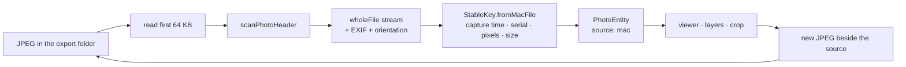
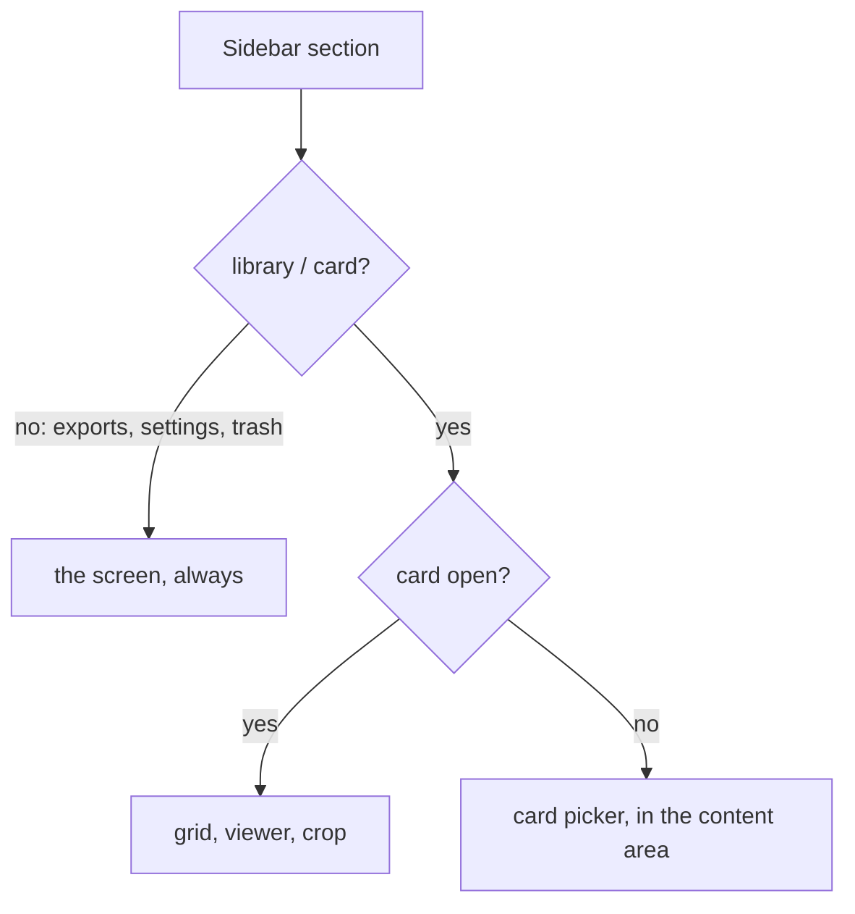

# Exports as a Working Directory - Plan

## Goal Capsule

- **Objective:** Make the Mac side of Obscura Pro usable on its own. With no card in the reader, Exports and the other card-independent destinations open and work; and the export folder stops being write-only — an exported file can be looked at properly, worked on, and whatever comes out of that work lands back in the same folder.
- **Authority hierarchy:** `docs/reference/spec-q3-culling.md` remains authoritative for everything on the card side, and this plan may not weaken it — SECU-CARTE (zero parasite files, read-only card) and KTD-14 (the deletion state machine) are untouched. The spec has no notion of a Mac-side working folder, so **this plan is the authority for that part** and must say so where it goes beyond the spec. `docs/reference/design-system.md` stays authoritative for visual style.
- **Execution profile:** Extends a shipped app. Units are dependency-ordered; U1 is independently shippable and worth landing first because it is the user-visible half of the request. U3 is the hinge — U4 and U5 are unreachable without it.
- **Stop conditions:** Stop and surface if (a) a security-scoped bookmark cannot be minted for a user-chosen export folder — shipping the chooser without one leaves the working directory unreadable after a relaunch; (b) opening a full-resolution export in the viewer cannot be done inside the MEM-1 budget, which would mean the viewer is the wrong entry point for exports; (c) any step would write to the card.

---

## Product Contract

### Summary

Make Exports reachable and useful with no card open, and turn the export folder into the place work happens: exports become photographs the app can show full-frame, compose on and re-cut, with every result written back beside its source.

### Problem Frame

The app is shaped around a card. `main.dart` decides the whole content area on one boolean: no card open means the volume picker fills the window, so clicking **Exports**, **Réglages** or **Corbeille** in the sidebar changes the selected section and nothing else — the picker stays. Every one of those screens reads from the Mac and would work perfectly well with the reader empty. A photographer who wants to look at what they exported last night has to put a card back in first, which is the app asking for something it does not need.

The second half is the same problem one level up. Exports are currently a terminus: files are written, listed, and can be revealed or trashed. Nothing can be *done* with them. A crop of a crop, a composition laid over an exported frame, a proper full-frame look at the file that will actually be delivered — none of it is reachable, even though the viewer, the crop screen and the layers panel all already work on any `PhotoEntity` and would work on these files with no change to their logic.

The user's framing is the right one: the export folder is a working directory. What follows from that is not a new subsystem but a second source of photographs, on the Mac, that the existing screens can already handle.

### Requirements

- **R1.** The card-independent destinations — Exports, Réglages, Corbeille — open and show their real content when no card is open.
- **R2.** The card-dependent destinations — Bibliothèque, Carte SD — say why they are empty and offer the card picker, rather than the picker replacing the whole window.
- **R3.** The status strip stays truthful with no card: it does not claim a photograph count or free space it cannot know.
- **R4.** An export folder chosen by the user in Réglages is still readable and writable after the app is relaunched.
- **R5.** A file in the export folder can be turned into a photograph the app understands — its own pixels, its own EXIF, its own orientation, its own identity — without a card being present.
- **R6.** An export opens full-frame in the viewer, with EXIF, obscura and composition layers, and its layers are remembered per file.
- **R7.** An export can be re-cropped, and the result is written into the export folder beside the file it came from, as a new file. Nothing is ever overwritten.
- **R8.** Nothing in the exports path can mark a file for card deletion or otherwise reach the card. The only removal offered for an export stays the Mac's Trash.
- **R9.** The export folder is never on the card. A folder on a removable volume is refused when it is chosen, and refused again before anything is written to it.
- **R10.** A crop of an export is cut from that export. The app does not reach back to the frame it came from, whether or not the card is in the reader.

### Acceptance Examples

- **AE1.** Launch the app with no card in the reader, click **Exports**: the list of exported files appears, with its thumbnails, its refresh and its queue panel. Click **Bibliothèque**: the card picker appears in the content area, with the sidebar still usable.
- **AE2.** Choose an export folder outside the app's container in Réglages, quit, relaunch, open Exports: the folder's files are listed and an export still writes into it.
- **AE3.** Open an export full-frame, press `L`, place a spiral on it, close the viewer, reopen the same export: the spiral is still there. Move the file to another folder inside the export root and reopen it: the spiral is still there.
- **AE4.** Open an export full-frame, press `C`, cut a square out of it, export: a new file appears in the same session folder, the source file is byte-for-byte unchanged, and the new file is listed on the exports screen.
- **AE5.** With an export open full-frame, press `⌫`: nothing is marked, no trash row is written, and the interface says why.
- **AE6.** In Réglages, point the export-folder chooser at a folder on the mounted card: it is refused, the reason is stated, and the folder in use does not change.

### Scope Boundaries

- Importing an arbitrary folder as a library. The working directory is *the export folder*, not a general file browser.
- Editing pixels: exposure, colour, retouching. The app cuts and composes; it does not develop.
- Burning composition layers into an exported file (this remains the documented gap in `docs/BACKLOG.md` — a guide is a judgement, not a deliverable).
- Writing anything back to the card, including "restore this export to the card" and using the card as the export folder.
- Re-cutting from the original card frame when a crop of an export is asked for. The file on screen is the source (R10, KTD-9).
- Deletion marks, the trash state machine, or Empty Trash reaching Mac files.

#### Deferred to Follow-Up Work

- Walking from an export back to the frame it was cut from (the `crop_export` row holds the photo id, so the link exists in the data but has no interface).
- Filtering or searching the exports list, which the same BACKLOG entry already records as thin at a year's scale.
- A second working root — several folders, or per-job folders — beyond the single chosen export folder.

### Outstanding Questions

- **Deferred.** Should a re-crop's `crop_export` row point at the export it was cut from (this plan's choice, KTD-5) or be walked back to the original card frame? Pointing at the export keeps each hop truthful; walking back would need a chain the schema does not carry yet.
- **Deferred.** Should the exports viewer offer the export mark (`E`)? Marking an export for export is close to meaningless today, but a future "re-export at another ratio" queue would want it.

---

## Planning Contract

### Key Technical Decisions

- **KTD-1. Exports become photographs, not a new media type.** An exported JPEG is turned into a `PhotoEntity` with a `wholeFile` preview stream, and every existing screen — viewer, crop, layers panel — takes it unchanged. The alternative was a parallel "export viewer" with its own image widget, its own crop and its own layer canvas; that is three duplicated subsystems whose behaviour would drift from the card's within a release. The one thing the entity cannot carry is a card path, which is exactly what R8 needs to be impossible.
- **KTD-2. Identity comes from the file's own content, not from its path.** `StableKey` gains a third basis for Mac-side files, composed of the EXIF capture time, the body serial, the pixel dimensions and the byte size. A path-derived key is one Finder drag away from losing a composition; the app's whole identity discipline exists because paths are not identities. The cost is that two exports of the same frame at the same ratio and identical size would collide, which the index suffix in the file name makes vanishingly unlikely and which a test pins.
- **KTD-3. The grid draws files, the viewer decodes them.** The exports grid keeps drawing thumbnails straight from the file through `exportImageProvider` (already shipped), and only the viewer goes through the decode pipeline. A 9520 × 6336 export has no smaller embedded preview, so routing the grid through the pipeline would ask it to downscale a full frame per tile — the same escalation-budget problem `docs/BACKLOG.md` records for JPG-only cards. The viewer decodes one frame at a time and is where that cost belongs.
- **KTD-4. The exports grid gets its own cursor.** `gridCursorProvider` is shared between the card grid and the viewer by design — that is what keeps the selection in step. Reusing it for exports would make browsing exports move the selection in the card grid underneath. A second cursor provider keeps the two libraries independent; the viewer takes the cursor it should read as a parameter rather than reaching for the global one.
- **KTD-5. A re-crop is recorded against the export it was cut from.** `crop_export.photoId` points at the export's own photo row. Each row then says something true about one hop, and the exports screen keeps working with no schema change. Recording it against the original card frame would be a claim the app cannot verify without the card in the reader.
- **KTD-6. A chosen export folder is bookmarked exactly like a card.** `BookmarkStore` already does this for `/Volumes`; the export folder gets a key of its own, minted in the same turn as the `getDirectoryPath` selection, because a bookmark can only be created while the panel's implicit grant is live. Today the chosen path is stored bare and the sandbox denies it after a relaunch — a bug the current write-only usage mostly hides, and which a working directory would surface every morning.
- **KTD-8. The export folder is refused on a removable volume.** The chooser rejects a path that resolves onto a mounted removable volume, and the write path checks again before creating anything. Twice, because the two checks answer different questions: the first stops an obvious mistake at the moment it is made, and the second catches a folder that *became* a card path afterwards — mount points are reused, and `/Volumes/Untitled` is a different volume on a different day. Without this, the feature that makes the export folder somewhere a photographer thinks about is also the feature that invites them to point it at the card, and SECU-CARTE — the guarantee the whole app is built on — would fall to a file chooser.
- **KTD-9. A crop of an export is cut from that export.** The app does not go back to the frame on the card, even when the card is in the reader. Chosen deliberately over re-cutting the original: the working directory is meant to work on its own, and a crop that silently sourced different pixels from the ones on screen would be the app doing something other than what it showed. The cost is generation: an export is already a re-encode at quality 92, and a crop of it is a second one. That is accepted and recorded here rather than raised as a warning in the interface — a photographer working in the export folder has chosen to work there.
- **KTD-7. The deletion mark is unavailable wherever the photograph came from the Mac.** The viewer's `⌫` writes a trash row whose `cardRelativePath` is composed from a DCF folder and file name; on a Mac file that path is fiction, and Empty Trash would act on it. The mark is refused at the source — the entity carries where it came from — rather than by hiding the button, so no future screen can reintroduce the path by accident.

### Risks and Mitigations

- **A full-resolution export is a heavy thing to open.** A 9520 × 6336 JPEG has no smaller embedded stream, so the viewer decodes the whole file to show it. The existing pipeline sizes its decode to the viewport, which is the mitigation, but the escalation budget was written for card previews and may refuse this. If it does, the fallback is a file-backed image at the viewer's own width — worse on zoom, honest about it — and the stop condition in the Goal Capsule fires first if neither works.
- **Two exports could share an identity.** KTD-2's key is content-derived, so two files that agree on capture time, serial, pixel size *and* byte size would merge their compositions. The index suffix makes byte-identical exports of the same frame practically impossible, and a test pins the discrimination; the residual risk is accepted rather than paid for with a full content hash of a 12 MB file per tile.
- **A working directory invites the card's habits.** The most likely regression in this work is a Mac file reaching a card path — through the deletion mark, the trash screen, or a future screen that reuses the entity. KTD-7 refuses it at the store rather than in the widget, and U4 pins it, because a refusal that lives in a button can be lost by adding a second button.
- **The bookmark is a sandbox behaviour no test can prove.** `RecordingBridge` grants whatever it is asked for, so U2's tests prove the ordering and the balance, not the grant. Only the manual check on a signed build (AE2) proves the folder is actually readable next launch — the same honest limit `docs/BACKLOG.md` already records for the card's reopen.

### High-Level Technical Design

How a file in the export folder becomes something the existing screens can show:

The shell routing that R1 and R2 change — the card gate moves off the window and onto the two destinations that actually need it:

Both diagrams are directional: the prose and the units are authoritative where they disagree.

---

## Implementation Units

### U1. The window stops being a card gate

- **Goal:** Exports, Réglages and Corbeille work with no card in the reader; Bibliothèque and Carte SD explain themselves and offer the picker.
- **Requirements:** R1, R2, R3; AE1.
- **Dependencies:** none.
- **Files:** `lib/main.dart`, `lib/features/grid/grid_screen.dart`, `lib/app/status_bar.dart`, `test/features/grid/grid_screen_test.dart`, `test/app/status_bar_test.dart` (new if absent).
- **Approach:** The session widget stops choosing between `VolumeScreen` and `LibraryScreen` on the card boolean and always renders the section router; `LibraryScreen` gains the card gate for its two card-dependent sections only. The status bar renders a cardless variant that states the export count and the keyboard map that actually applies, instead of "0 photographies" and a card's free space it cannot read.
- **Patterns to follow:** the existing `switch (ref.watch(librarySectionProvider))` in `LibraryScreen`; the `_Field` composition in `status_bar.dart`.
- **Test scenarios:**
  - With no card open and the section set to exports, the exports screen is rendered and the volume picker is not.
  - With no card open and the section set to library, the volume picker is rendered inside the content area and the sidebar is still present.
  - With no card open, the status bar does not render the photograph count or the free-space field.
  - Covers AE1. Opening a card while the exports section is selected leaves the user on exports rather than yanking them to the grid.
  - Corbeille with no card renders the trash screen (it reads the Mac database) rather than the picker.
- **Verification:** the app launches with an empty reader onto a usable Exports screen; every existing grid and status-bar test still passes.

### U2. A chosen export folder survives a relaunch

- **Goal:** The folder the user picks in Réglages is still readable and writable next launch.
- **Requirements:** R4, R9; AE2, AE6.
- **Dependencies:** none (independent of U1).
- **Files:** `lib/infra/card_access/bookmark_store.dart`, `lib/features/settings/settings_screen.dart`, `lib/features/settings/settings_store.dart`, `lib/features/crop/crop_screen.dart` (folder resolution), `lib/features/exports/export_store.dart` (folder resolution), `test/infra/card_access/bookmark_store_test.dart`, `test/features/settings/settings_store_test.dart`, `test/features/settings/settings_screen_test.dart` (new).
- **Approach:** Mint a bookmark for the chosen directory in the same turn as the `getDirectoryPath` selection, under a key of its own, and take its scope when the folder is read or written. Resolve at startup like the card does — scope first, then look. A folder inside the app's own container needs no bookmark and must not be made to look as if it does.
- **Execution note:** The failure this fixes is invisible until a relaunch; add the failing case first — resolve a chosen folder in a fresh store and prove access is refused without the bookmark.
- **Patterns to follow:** `CardAccessService.chooseCard` for the mint-then-resolve-then-hold order, and its comment about why the order cannot be reversed. `volumeRootOf` in `atomic_ops.dart` and `availableCards()` for deciding whether a path sits on removable media.
- **Test scenarios:**
  - Choosing a folder writes a bookmark under the export key, in the same turn as the selection.
  - A later session resolves that bookmark and takes the scope before reading the folder.
  - A bookmark that no longer resolves (folder deleted or renamed) degrades to the default folder and says so, rather than leaving the app pointing at nothing.
  - Every start of access is balanced by a stop, including on the failure paths.
  - The default in-container folder is used without any bookmark being minted.
  - Covers AE6. A folder on a mounted removable volume is refused at the chooser, with the reason stated and the folder in use unchanged.
  - A folder recorded earlier that now resolves onto a mounted removable volume is refused before anything is written, and the export says so rather than writing to the card.
  - A folder under the user's home is accepted; the check keys on the volume, not on the word `Volumes` appearing in a path.
- **Verification:** AE2 by hand on a signed build — choose `~/Pictures/Somewhere`, quit, relaunch, list and export.

### U3. A file on the Mac becomes a photograph

- **Goal:** Turn a JPEG in the export folder into a `PhotoEntity` the existing screens accept, with an identity that survives the file being moved.
- **Requirements:** R5; AE3 (identity half).
- **Dependencies:** none, though it is only *visible* through U4.
- **Files:** `lib/features/catalog/stable_key.dart`, `lib/features/exports/export_photo.dart` (new), `lib/features/exports/export_store.dart`, `test/features/catalog/stable_key_test.dart`, `test/features/exports/export_photo_test.dart` (new).
- **Approach:** Read the file's head, run the existing header scanner, and build an entity whose single preview stream is the whole file and whose EXIF, orientation and capture settings come from that scan. The entity must also carry the file itself in its file list — the decode and export paths both resolve their bytes through `fileForStream`, which returns nothing for an entity with no files and would fail at the point of use rather than at the point of construction. The DCF radical the catalogue row needs is the file's own stem; it is a name, not a claim that the file is on a card. Identity per KTD-2. The entity records that it came from the Mac, which is what U4's refusal and U5's naming both read.
- **Patterns to follow:** `scanPhotoHeader` and its `wholeFile` fallback in `preview_extractor.dart`; `DcfScanner`'s bounded-concurrency read loop; `StableKey`'s existing two factories and the honesty of its `basis` field.
- **Test scenarios:**
  - A real exported JPEG yields an entity whose preview stream is the whole file, with the pixel size the header declares.
  - The entity carries the EXIF the export re-embedded — capture time, model, ISO — so the viewer's overlay is not empty.
  - The same file at a different path yields the same identity; two different files never do.
  - A JPEG with no readable EXIF still yields an entity, with the weaker basis recorded rather than hidden.
  - A file that is not a JPEG, or is truncated, yields nothing rather than an entity that will fail to decode later.
  - The entity carries no card-relative path and no DCF folder.
  - `fileForStream` resolves the entity's own file, so the decode and export paths have bytes to read.
- **Verification:** unit tests only; the entity is proven in use by U4.

### U4. An export opens full-frame

- **Goal:** Open an export in the viewer from the exports grid, with EXIF, obscura and layers, and no way to mark it for card deletion.
- **Requirements:** R6, R8; AE3, AE5.
- **Dependencies:** U3 (and U1 for the cardless case to be reachable).
- **Files:** `lib/features/exports/exports_screen.dart`, `lib/features/viewer/viewer_screen.dart`, `lib/features/grid/grid_screen.dart` (cursor extraction), `lib/features/trash/trash_providers.dart` (refusal), `test/features/exports/exports_viewer_test.dart` (new), `test/features/viewer/viewer_test.dart`.
- **Approach:** The exports grid gains a cursor of its own (KTD-4) and opens the viewer over the list of export entities; the viewer takes which cursor to read rather than assuming the card's. The deletion mark is refused for a Mac-sourced entity at the store, and the viewer states the refusal rather than silently doing nothing. Layers work with no change — they are keyed by stable key, which U3 provides.
- **Patterns to follow:** `LibraryGrid`'s cursor/`onOpen` split; `ViewerScreen`'s existing `photos` parameter; the mark-refusal wording already used for a refused card write in `mark_store.dart`.
- **Test scenarios:**
  - Double-clicking an export tile opens the viewer on that file; arrows move through the exports, not through the card.
  - Browsing exports leaves the card grid's own selection where it was.
  - Covers AE3. A layer placed on an export is there when the same export is reopened, and after the file has been moved within the export root.
  - Covers AE5. `⌫` on an export marks nothing, writes no trash row, and says why.
  - The EXIF overlay shows the capture time and model the exported file carries.
  - An export whose file was deleted behind the app's back fails to open with a stated reason rather than a blank frame.
- **Verification:** by hand — open an export at fit and at 100 %, toggle obscura, place and drag a guide.

### U5. A crop of an export lands beside it

- **Goal:** Re-cut an export and write the result into the export folder, next to the file it came from.
- **Requirements:** R7, R10; AE4.
- **Dependencies:** U3, U4.
- **Files:** `lib/features/crop/export_service.dart` (naming), `lib/features/crop/crop_screen.dart` (destination), `lib/features/exports/export_store.dart` (recording), `test/features/crop/export_service_test.dart`, `test/features/exports/export_store_test.dart`.
- **Approach:** The destination folder for a crop of a Mac-sourced photograph is the folder that photograph lives in, not today's dated folder — a re-cut belongs with its source. The name is derived by stripping a trailing ratio-and-index suffix from the source stem before appending the new one, so a square cut of `L1000864_3x2_01.jpg` does not become `L1000864_3x2_01_1x1_01.jpg`. The row is recorded against the export's own identity (KTD-5), and the list is invalidated as it already is for a card export.
- **Patterns to follow:** `ExportService.nextFileName`'s never-overwrite loop; the record-after-the-bytes-land order in `crop_screen.dart`.
- **Test scenarios:**
  - Covers AE4. A square cut of an export writes a new file in the source's own folder, and the source file's bytes are unchanged.
  - The new name carries the new ratio and its own index, without accumulating the source's suffix.
  - A second cut at the same ratio increments rather than overwriting.
  - The exported pixels are cut from the source file at full size, not from the display-sized bitmap.
  - The recorded row points at the export's identity and appears in the list without a manual refresh.
  - A crop of a card photograph still lands in today's dated folder — the rule changes only for Mac-sourced sources.
  - The pixels come from the export on screen, not from the card frame it was cut from, whether or not a card is open.
- **Verification:** AE4 by hand, then open the result in Preview.app and check it is the region that was framed.

---

## Verification Contract

- `flutter analyze` — zero issues.
- `flutter test` — the whole suite green; the units above add tests under `test/features/exports/`, `test/features/catalog/`, `test/infra/card_access/` and `test/features/crop/`.
- `flutter build macos --debug` — the app builds after any change touching the sandbox or the platform channels (U2).
- Manual, on a signed build with the reader empty: AE1 and AE2. With a card mounted: AE6.
- Manual, with a card and without: AE3, AE4, AE5.
- The card guarantee is re-checked once at the end: a full session with the card in, then `ls -la@` on the volume showing no file this app wrote. No unit here should be able to break it, which is exactly why it is worth proving.

## Definition of Done

- R1–R10 are met, and each acceptance example has been run by hand at least once.
- Every implementation unit's test scenarios exist as tests and pass.
- `flutter analyze` is clean and the suite is green.
- No path in the exports feature can write to the card or create a trash row for a Mac file — including through the export-folder chooser (R9).
- `docs/BACKLOG.md` records what this plan deliberately left out — burning layers into an export, the export-to-source link, filtering the list — and any gap found while building it.
- Abandoned approaches are removed rather than left in the diff; in particular, no half-wired second viewer or duplicate crop path survives if the entity route (KTD-1) proves out.
